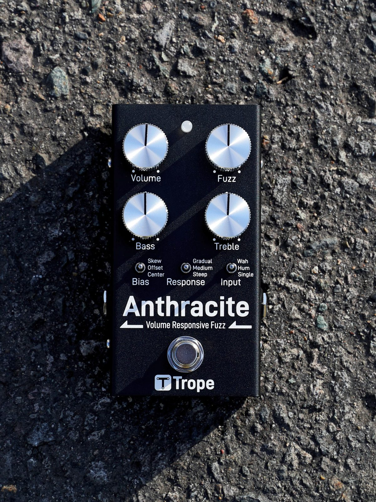
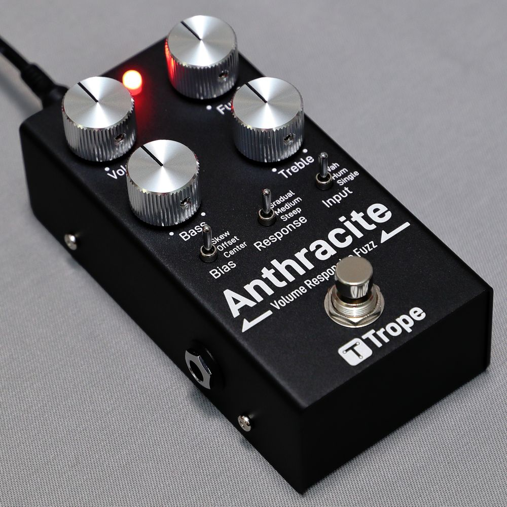
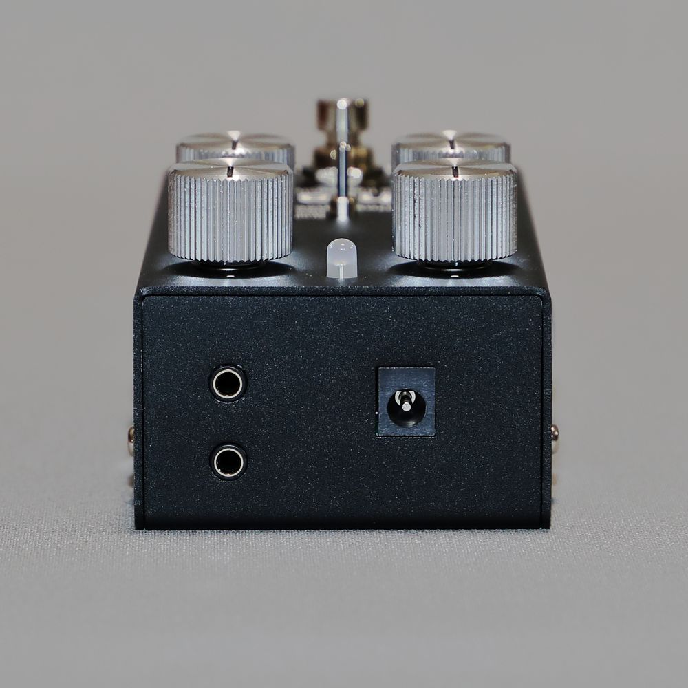
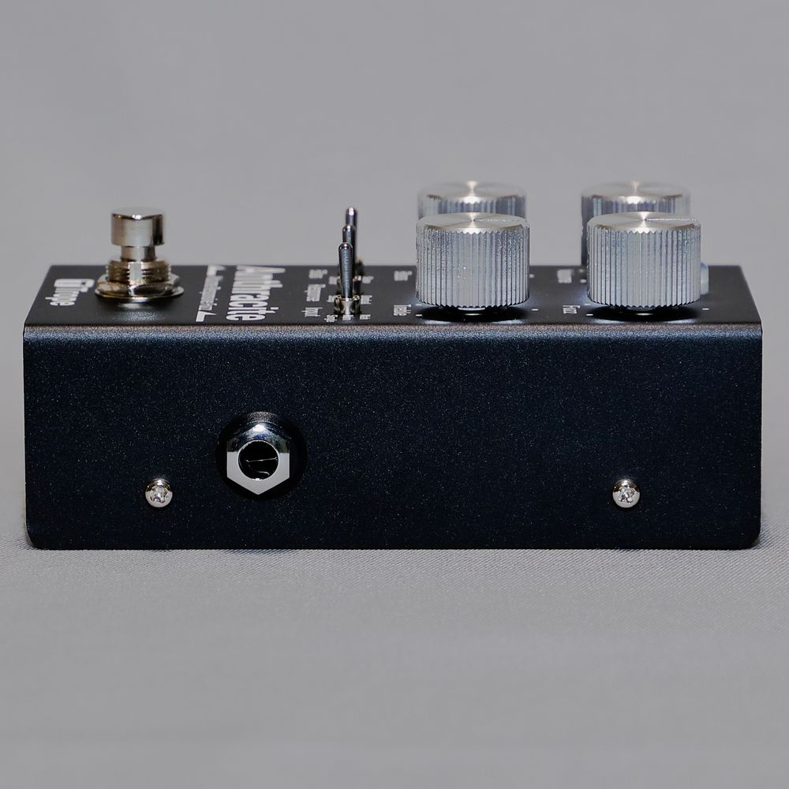

# Anthracite

A MIDI-controllable analogue fuzz pedal.

Fuzz pedals are awkward to live with: the sound changes when you swap guitars, a
wah in front of one loses its range, and few switchers can drive one. Most of
that traces back to a single cause — the input impedance of a fuzz is low, and
it is fixed. Anthracite lets you choose the load your pickup sees, and keeps the
whole signal path analogue: it is switched by analogue switches rather than
mechanical contacts, and the microcontroller only moves those switches and never
touches the audio.

Designed and built by [Trope](https://trope-oshw.org) (山本回路設計).



<table>
  <tr>
    <td align="center"></td>
    <td align="center"></td>
    <td align="center"></td>
  </tr>
  <tr>
    <td align="center">Angled view, LED lit</td>
    <td align="center">Top edge: MIDI IN / OUT (3.5 mm TRS) and 9 V DC</td>
    <td align="center">Input side: 1/4" jack</td>
  </tr>
</table>

## Specifications

| | |
|---|---|
| Power | 9 V DC, centre-negative, 5.5 / 2.1 mm barrel. No battery compartment |
| Operating voltage | 8.4 – 11.5 V |
| Recommended operating voltage | 8.6 – 10.0 V |
| Current draw | About **70 mA** at 9 V with the effect on (measured 67 – 74 mA depending on settings; about 4 mA less in bypass) |
| Adapter rating | 200 mA or more |
| Input impedance | About **13 kΩ** (Single) / **24 kΩ** (Hum) / **44 kΩ** (Wah) at 1 kHz, effect on |
| Input impedance, bypassed | About **1 MΩ** from 100 Hz to 1 kHz, measured |
| Output impedance | About **1 kΩ** at 1 kHz |
| Bypass | Buffered. Switched electronically — no mechanical contacts in the audio path |
| MIDI | 3.5 mm TRS, MIDI Type-A, 31250 baud. MIDI IN, and a MIDI OUT (Thru) jack that doubles as an external-switch input |
| Microcontroller | STM32F030C8T6 (Cortex-M0, 48 MHz, LQFP48) |
| Enclosure | 73.5 (W) × 57.5 (H) × 128 (D) mm including knobs and jacks, 268 g |

The pedal monitors its supply and flashes the LED if the voltage drops below
about 8 V or rises above about 12 V. The exact trip points vary slightly from
unit to unit, but the warning does not appear inside the operating voltage
range. Do not run the pedal outside that range even if no warning is shown.

The effect-on input impedance figures come from a SPICE model of the input
circuit and agree with measurements on a v1.0 unit. The impedance stays roughly
flat at low frequencies (about 24 / 34 / 55 kΩ at 20 Hz) and falls gradually
towards high frequencies. That roll-off is deliberate: a heavier load pulls the
pickup's resonant peak lower, and the Input switch selects between three loads.

### Boards

| Board | Size | Layers | Copper |
|---|---|---|---|
| Top (analogue) | 60 × 102 mm | 4 | 35 µm (1 oz) outer, 17.5 µm (0.5 oz) inner |
| Bottom (control) | 60 × 73.5 mm | 4 | 35 µm (1 oz) outer, 17.5 µm (0.5 oz) inner |
| Footswitch | 14 × 16.15 mm | 2 | — |

All boards are 1.6 mm FR-4.

## Controls

Four potentiometers and three three-position toggles.

| Control | Range |
|---|---|
| **Volume** | 50 kΩ, log (A taper) |
| **Fuzz** | 10 kΩ, reverse log (C taper), wired as a variable resistor. Roughly 39 dB to 65 dB of small-signal gain in the fuzz stage |
| **Bass** | 20 kΩ, linear (B taper). Low shelf: up to about −25 dB of cut and +13 dB of boost at 20 Hz. The half-way point moves between about 170 Hz and 390 Hz with the knob |
| **Treble** | 20 kΩ, linear (B taper). High shelf: up to about −26 dB of cut and +14 dB of boost at 10 kHz. The half-way point moves between about 700 Hz and 1.7 kHz, so it also acts on the midrange around 1 kHz |

Toggle positions are listed from top to bottom.

| Toggle | Positions | What it changes |
|---|---|---|
| **Bias** | Skew / Offset / Center | Operating point of the output-side fuzz transistor (3:1, 2:1, 1:1). More asymmetry means more even-order harmonics and less gain. Second harmonic moves from −16.7 dBc (Center) to −9.5 dBc (Skew) at 400 Hz / 0.1 Vpp, Fuzz 50 %. With DIP-SW2 on, the toggle selects X-Skew (4:1) / Skew / Offset instead |
| **Response** | Gradual / Medium / Steep | Series resistance at the fuzz input, which sets how abruptly the pedal cleans up as you roll back the guitar volume. THD at 400 Hz / 1 Vpp, Fuzz 50 %: 65.6 % / 59.7 % / 49.3 % |
| **Input** | Wah / Hum / Single | Input filter, which sets the loading your pickup sees (see the impedance figures above) |

## MIDI

The pedal receives; it never sends control messages of its own. MIDI IN is
active whichever way DIP-SW3 (MIDI mode / external-switch mode) is set.

| CC | Function | Values |
|---|---|---|
| **81** | Bypass / engage (channel 12, with DIP-SW4 off as shipped) | ≥ 64 engages, < 64 bypasses |
| **83** | Input | 0 = return to the physical toggle · 1–31 Single · 32–63 Hum · 64–95 Wah · 96–127 All-OFF (input filter disconnected) |
| **84** | Response | 0 = return to the toggle · 1–31 Steep · 32–63 Medium · 64–95 Gradual · 96–127 no change |
| **85** | Bias | 0 = return to the toggle · 1–31 Center · 32–63 Offset · 64–95 Skew · 96–127 X-Skew |

CC 83/84/85 are received on the same channel as the bypass / engage message.
Sending 0 to any of them hands control back to the physical toggle, so a MIDI
override never becomes something you cannot undo from the panel.

**MIDI-Learn** stores a channel and CC number for the bypass function in EEPROM;
with DIP-SW4 on, the pedal uses them instead of channel 12 / CC 81. Units ship
with **channel 6 / CC 1** already stored. Many MIDI foot controllers send their
expression pedal on CC 1, so with DIP-SW4 on, an expression pedal on channel 6
will switch the effect as it crosses value 64; learn a different CC or change
the controller's CC. If nothing is stored, DIP-SW4 on disables MIDI control
entirely rather than falling back to channel 12 / CC 81. Do not learn CC 83, 84
or 85. **Active Sensing** (0xFE) is emitted about every 250 ms, and received
messages are passed through to MIDI OUT unmodified, both only in MIDI mode
(DIP-SW3 on, as shipped). With DIP-SW3 off, the MIDI OUT jack becomes an
external footswitch input.

## What is in this repository

```
hardware/     KiCad projects for the three circuit boards (top, bottom and
              footswitch) and the front-panel artwork, with the symbol and
              footprint libraries they use; parts list (parts.md)
enclosure/    Enclosure 3D model (STEP), hole-layout and assembly drawings
              (PDF), front-panel artwork for laser marking (DXF, SVG, PNG)
firmware/     STM32 firmware source: STM32CubeMX project, CMake build, the
              ST HAL and CMSIS, and the build and flashing guide
docs/         Schematics (PDF, plus a PNG of each sheet), bills of materials
              (CSV), 3D models of the assembled boards (STEP), product photos
```

The STEP model and the drawings (PDF, DXF) are the reference for the
enclosure.

Gerbers and the ordering notes are attached to each
[release](https://github.com/trope-oshw/anthracite/releases) rather than kept in
the tree, so that what you download always matches a specific version. There is
no assembler-specific BOM or pick-and-place file: build them from `docs/bom-*.csv`
and the KiCad projects for whoever assembles your boards.

The user manual, measured data, and circuit explanations live at
**https://docs.trope-oshw.org** — they are not duplicated here.

## Building the boards

The KiCad projects need KiCad 10 or later. They are self-contained: every
custom symbol and footprint is in the project's own `libs/` directory, so you
can clone this repository and open them without installing anything else.

[`hardware/parts.md`](hardware/parts.md) lists the parts chosen for each board,
with manufacturer part numbers and LCSC numbers.

Ordering parameters used for the production run are recorded in
`ordering-notes.md` attached to each release. They matter, because a different
stackup or copper weight gives a different board.

## Firmware

The full source is in [`firmware/`](firmware/). Built as described in
[firmware/README.md](firmware/README.md), it reproduces the image on shipped
units byte for byte; that file gives the toolchain versions, the SHA-256 of the
image, and how to write it to a finished unit. You do not need to touch the
firmware to use the pedal; the instructions are there because being able to
replace the software on hardware you own is part of what this licence is for.

## Licensing

| What | Licence |
|---|---|
| Hardware (`hardware/`, `enclosure/`) | **CERN-OHL-S-2.0** |
| Firmware (`firmware/`), except the third-party code below | **GPL-3.0-or-later** |
| Generated design documents (`docs/`: schematics, bills of materials, board 3D) | **CERN-OHL-S-2.0** |
| Product photographs (`docs/images/`) | **CC-BY-SA-4.0** |
| Text (this README, CHANGELOG, ERRATA, CONTRIBUTING) | **CC-BY-SA-4.0** |

Full texts are in [`LICENSES/`](LICENSES/); per-file assignments are declared in
[`REUSE.toml`](REUSE.toml) following the [REUSE](https://reuse.software/)
specification. See [`COPYRIGHT.txt`](COPYRIGHT.txt) for the notices.

Parts of the firmware come from STMicroelectronics and Arm and keep their own
licences: the STM32F0 HAL driver and the code generated by STM32CubeMX are
BSD-3-Clause, and the CMSIS headers and ST's CMSIS device files are Apache-2.0.
Likewise, some footprints in `hardware/*/libs/` are derived from the KiCad
standard libraries and stay under CC-BY-SA-4.0 with the KiCad libraries
exception. The symbol libraries mix symbols derived the same way with symbols
drawn for this project, so both licences apply to them; `REUSE.toml` lists the
files.

## Trademark

The design files in this repository are open source under the licences above.
**The Trope and 山本回路設計 brand names, the Trope logo, and the product name
"Anthracite" are not.** They are trademarks of 山本回路設計 and are not licensed
to you by any of the licences here. See also section 8.2 of the CERN-OHL-S v2.

You are free to build, modify, and sell hardware derived from these files. When
you do, please give it your own name and your own branding. A modified version
could be called "Foobar Audio — Charcoal Fuzz"; it should not be called
"Anthracite" or "Trope Anthracite".

You may state truthfully that your product is *based on the Anthracite design by
Trope*. You may not use the Trope logo, or a name so close to Trope or Anthracite
that a buyer could confuse the two.

**All Trope branding has been removed from the published files**, both the
panel artwork and the circuit-board silkscreen, so hardware made from these
files carries no Trope marks by default. Please keep it that way. Instead of a
product name, the top and bottom boards carry the board version (`V1.0`), the
licence (CERN-OHL-S-2.0) and where the source lives
(`github.com/trope-oshw/anthracite`).

Boards from the first production run carry `Anthracite V1.0` on the silkscreen
instead. That text is the only difference: electrically they are the same as the
published boards. Units built by Trope after that run use the published board
files as they are.

Questions, or a request to use the marks: trope.oshw@gmail.com — ask first and
the answer is almost always yes.

## Versions

The product and the boards carry a `vMAJOR.MINOR` number, silkscreened on the
PCB. The firmware carries its own semantic version. They move independently:
fixing a firmware bug does not change the boards, so the board version stays put.

See [CHANGELOG.md](CHANGELOG.md) for what changed in each release, and
[ERRATA.md](ERRATA.md) for problems found in hardware that has already been
built. **If your unit behaves differently from this documentation, check the
errata first.**

## Buying one

Anthracite is on sale. Trope builds and tests each unit and ships it with its
own test report. The product page at **https://trope-oshw.org/anthracite/**
shows the current price and takes orders. Trope plans to publish the cost
breakdown and the formula behind the price at **https://docs.trope-oshw.org**.
Questions go to trope.oshw@gmail.com.

Buying one is what pays for the next design being opened.

## Contributing

Issues are welcome; pull requests to the hardware are not, for reasons explained
in [CONTRIBUTING.md](CONTRIBUTING.md). Firmware and documentation PRs are
welcome.

## Disclaimer

This design is distributed **as-is, with no warranty of any kind**, express or
implied, including merchantability and fitness for a particular purpose. See
sections 6.1 and 6.2 of the CERN-OHL-S v2 for the full disclaimer.

If you build, modify, or sell hardware based on these files, **you are the
manufacturer** of that hardware. You alone are responsible for its safety and
for its compliance with every regulation that applies where you place it on the
market. Any certification, testing, or conformity marking obtained by
山本回路設計 applies **only to units built and sold by 山本回路設計**, and does
not transfer to your build.

Use a regulated, correctly-polarised 9 V DC supply. Incorrect power can damage
the pedal and whatever is connected to it.
